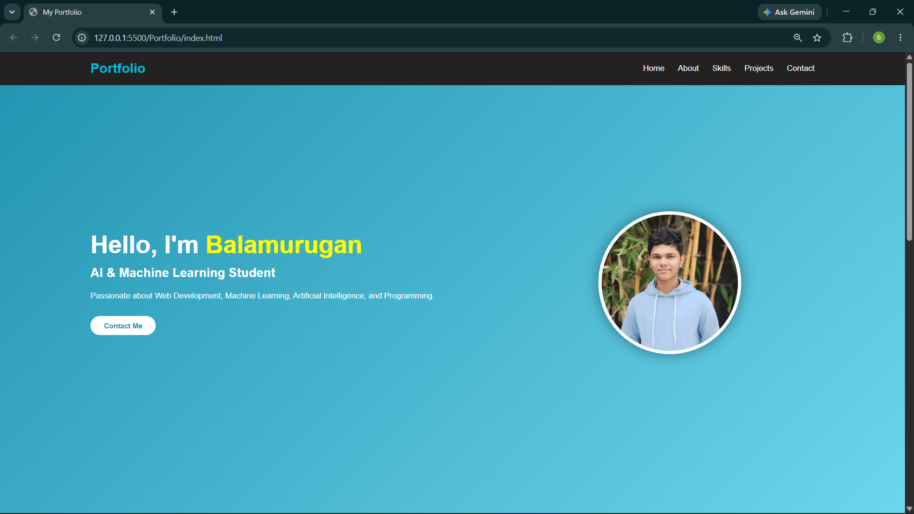
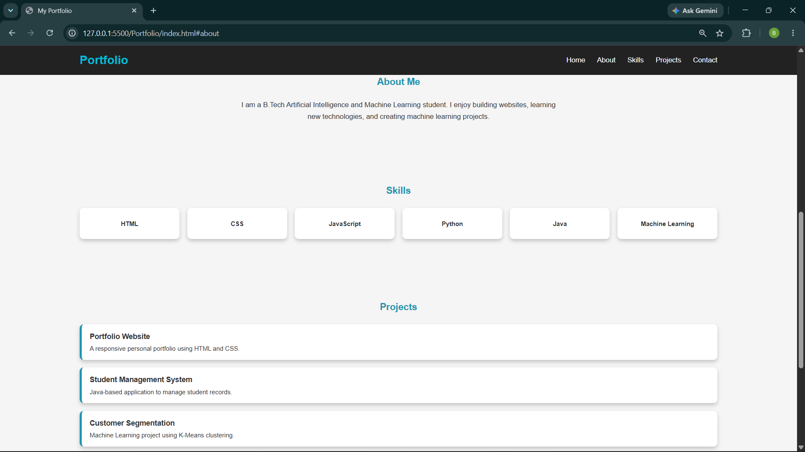
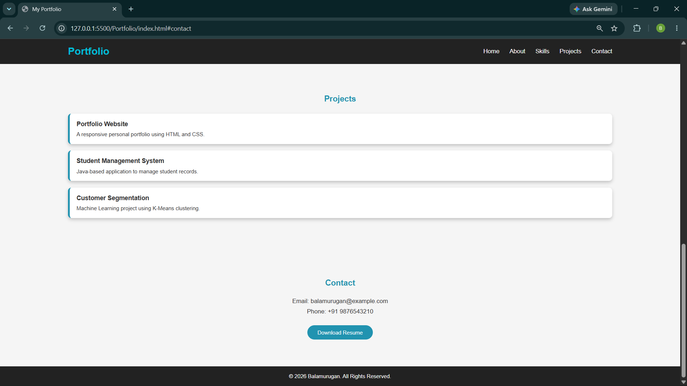

# Ex01 Portfolio
## Date:25/07/2026

## AIM
To create a Portfolio using HTML and CSS.

## ALGORITHM
### STEP 1
Create an HTML file (index.html)

### STEP 2
Create a CSS file (style.css)

### STEP 3
Include a navigation bar with links to different sections.

### STEP 4
Add structured sections for introduction, about, projects, and contact details.

### STEP 5
Define global styles for fonts, colors, and layout.

### STEP 6
Style the header, navigation bar, and sections.

### STEP 7
Use Flexbox or CSS Grid for layout design.

### STEP 8
Add hover effects and transitions for interactivity.

### STEP 9
Add Images and Media.

### STEP 10
Use optimized images for a professional look.

### STEP 11
Open the HTML file in a browser to check layout and functionality.

### STEP 12
Fix styling issues and refine content placement.

### STEP 13
Deploy the Portfolio.

### STEP 14
Upload to GitHub Pages for free hosting.

## PROGRAM

### index.html
```html
<!DOCTYPE html>
<html lang="en">
<head>
    <meta charset="UTF-8">
    <meta name="viewport" content="width=device-width, initial-scale=1.0">
    <title>My Portfolio</title>
    <link rel="stylesheet" href="style.css">
</head>
<body>

    <!-- Header -->
    <header>
        <nav>
            <h2 class="logo">Portfolio</h2>
            <ul>
                <li><a href="#home">Home</a></li>
                <li><a href="#about">About</a></li>
                <li><a href="#skills">Skills</a></li>
                <li><a href="#projects">Projects</a></li>
                <li><a href="#contact">Contact</a></li>
            </ul>
        </nav>
    </header>

    <!-- Home -->
    <section id="home" class="hero">

        <div class="content">
            <h1>Hello, I'm <span>Balamurugan</span></h1>
            <h3>AI & Machine Learning Student</h3>

            <p>
                Passionate about Web Development, Machine Learning,
                Artificial Intelligence, and Programming.
            </p>

            <a href="#contact" class="btn">Contact Me</a>
        </div>

        <div class="profile">
            
        </div>

    </section>

    <!-- About -->
    <section id="about">
        <h2>About Me</h2>
        <p>
            I am a B.Tech Artificial Intelligence and Machine Learning student.
            I enjoy building websites, learning new technologies, and creating
            machine learning projects.
        </p>
    </section>

    <!-- Skills -->
    <section id="skills">
        <h2>Skills</h2>

        <div class="cards">
            <div class="card">HTML</div>
            <div class="card">CSS</div>
            <div class="card">JavaScript</div>
            <div class="card">Python</div>
            <div class="card">Java</div>
            <div class="card">Machine Learning</div>
        </div>
    </section>

    <!-- Projects -->
    <section id="projects">
        <h2>Projects</h2>

        <div class="project">
            <h3>Portfolio Website</h3>
            <p>A responsive personal portfolio using HTML and CSS.</p>
        </div>

        <div class="project">
            <h3>Student Management System</h3>
            <p>Java-based application to manage student records.</p>
        </div>

        <div class="project">
            <h3>Customer Segmentation</h3>
            <p>Machine Learning project using K-Means clustering.</p>
        </div>
    </section>

    <!-- Contact -->
    <section id="contact">
        <h2>Contact</h2>

        <p>Email: balamurugan@example.com</p>
        <p>Phone: +91 9876543210</p>

        <button>Download Resume</button>
    </section>

    <!-- Footer -->
    <footer>
        <p>&copy; 2026 Balamurugan. All Rights Reserved.</p>
    </footer>

</body>
</html>
```
### style.css

```css
*{
    margin:0;
    padding:0;
    box-sizing:border-box;
    font-family:Arial, Helvetica, sans-serif;
    scroll-behavior:smooth;
}

body{
    background:#f5f5f5;
    color:#333;
}

/* Header */

header{
    background:#222;
    position:fixed;
    width:100%;
    top:0;
    z-index:1000;
}

nav{
    display:flex;
    justify-content:space-between;
    align-items:center;
    padding:20px 10%;
}

.logo{
    color:#00bcd4;
    font-size:30px;
}

nav ul{
    display:flex;
    list-style:none;
}

nav ul li{
    margin-left:30px;
}

nav ul li a{
    color:white;
    text-decoration:none;
    font-size:18px;
    transition:.3s;
}

nav ul li a:hover{
    color:#00bcd4;
}

/* Home Section */

.hero{
    min-height:100vh;
    display:flex;
    justify-content:space-between;
    align-items:center;
    padding:100px 10%;
    background:linear-gradient(135deg,#2193b0,#6dd5ed);
    color:white;
}

.content{
    width:55%;
}

.content h1{
    font-size:55px;
    margin-bottom:15px;
}

.content span{
    color:yellow;
}

.content h3{
    font-size:28px;
    margin-bottom:20px;
}

.content p{
    font-size:18px;
    line-height:30px;
    margin-bottom:30px;
}

.btn{
    display:inline-block;
    padding:12px 30px;
    background:white;
    color:#2193b0;
    text-decoration:none;
    border-radius:30px;
    font-weight:bold;
    transition:.3s;
}

.btn:hover{
    background:#222;
    color:white;
}

/* Profile Image */

.profile{
    width:40%;
    display:flex;
    justify-content:center;
}

.profile img{
    width:320px;
    height:320px;
    border-radius:50%;
    object-fit:cover;
    border:8px solid white;
    box-shadow:0 0 30px rgba(0,0,0,.4);
    transition:.5s;
}

.profile img:hover{
    transform:scale(1.05);
}

/* Sections */

section{
    padding:80px 10%;
}

section h2{
    text-align:center;
    color:#2193b0;
    margin-bottom:30px;
}

/* About */

#about p{
    text-align:center;
    max-width:800px;
    margin:auto;
    font-size:18px;
    line-height:30px;
}

/* Skills */

.cards{
    display:grid;
    grid-template-columns:repeat(auto-fit,minmax(150px,1fr));
    gap:20px;
}

.card{
    background:white;
    padding:30px;
    text-align:center;
    border-radius:10px;
    box-shadow:0 5px 10px rgba(0,0,0,.2);
    transition:.3s;
    font-weight:bold;
}

.card:hover{
    transform:translateY(-10px);
    background:#2193b0;
    color:white;
}

/* Projects */

.project{
    background:white;
    padding:20px;
    margin:20px 0;
    border-left:6px solid #2193b0;
    border-radius:10px;
    box-shadow:0 5px 10px rgba(0,0,0,.2);
}

.project h3{
    margin-bottom:10px;
}

/* Contact */

#contact{
    text-align:center;
}

#contact p{
    margin:10px 0;
    font-size:18px;
}

button{
    margin-top:20px;
    padding:12px 30px;
    border:none;
    border-radius:30px;
    background:#2193b0;
    color:white;
    font-size:16px;
    cursor:pointer;
}

button:hover{
    background:#0d6efd;
}

/* Footer */

footer{
    background:#222;
    color:white;
    text-align:center;
    padding:20px;
}

/* Responsive */

@media(max-width:768px){

nav{
    flex-direction:column;
}

nav ul{
    flex-direction:column;
    margin-top:15px;
}

nav ul li{
    margin:10px 0;
}

.hero{
    flex-direction:column-reverse;
    text-align:center;
    padding-top:140px;
}

.content{
    width:100%;
}

.profile{
    width:100%;
    margin-bottom:30px;
}

.profile img{
    width:220px;
    height:220px;
}

.content h1{
    font-size:40px;
}

.content h3{
    font-size:22px;
}
}
```

## OUTPUT





## RESULT
The program for creating Portfolio using HTML and CSS is executed successfully.
